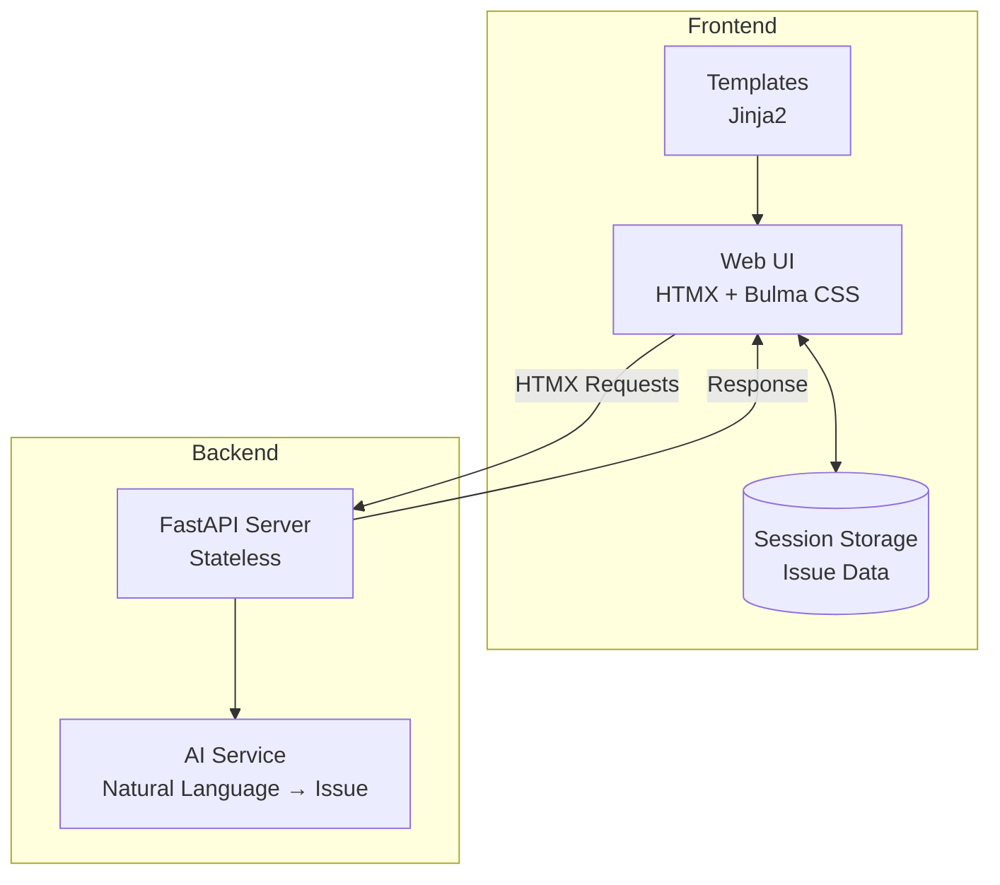

# システムパターンと技術的決定

## 1. アーキテクチャパターン

### クライアントサイド中心のアーキテクチャ


#### 採用理由
- データの一時性を活かしたセッションベース設計
- サーバーサイドの複雑性削減
- クライアントサイドでの即時レスポンス

## 2. 技術選択の理由

### フロントエンド
1. **HTMX**
   - サーバーサイドレンダリングとの相性
   - 最小限のJavaScript
   - 部分的な更新の容易さ

2. **Bulma CSS**
   - モダンで軽量
   - カスタマイズの容易さ
   - レスポンシブデザインのサポート

### バックエンド
1. **FastAPI**
   - 高パフォーマンス
   - 型安全性
   - OpenAPI自動生成

2. **Jinja2**
   - Pythonとの統合
   - テンプレートの継承
   - HTMXとの相性

## 3. データ管理パターン

### セッションストレージ設計
```javascript
{
  "issues": [
    {
      "id": "uuid-v4",
      "title": "string",
      "story": "string",
      "criteria": "string",
      "requirements": "string",
      "created_at": "ISO string"
    }
  ],
  "current_issue": null
}
```

#### 採用理由
- データの一時性
- サーバーレス運用
- シンプルなデータ構造

## 4. コード構造パターン

### 単一ファイル原則
```
issue-draft-creator/
├── main.py         # すべてのバックエンドロジック
├── pyproject.toml  # 依存関係定義
└── templates/      # UIテンプレート
```

#### 採用理由
- コードの見通しの良さ
- 依存関係の最小化
- デプロイの簡素化

## 5. インタラクションパターン

### HTMX拡張パターン
```javascript
htmx.defineExtension('issue-manager', {
  init: function(api) {
    // 初期化ロジック
  },
  onEvent: function(name, evt) {
    // イベントハンドリング
  }
});
```

#### 採用理由
- カプセル化された機能
- グローバルスコープの汚染防止
- イベントベースの処理

## 6. エラー処理パターン

### 階層的エラーハンドリング
1. クライアントサイド
   - セッションストレージエラー
   - ネットワークエラー
   - バリデーションエラー

2. サーバーサイド
   - APIエラー
   - AIサービスエラー
   - バリデーションエラー

## 7. テストパターン

### テスト戦略
1. フロントエンド
   - HTMX拡張のユニットテスト
   - セッション操作のテスト

2. バックエンド
   - APIエンドポイントテスト
   - AI変換テスト