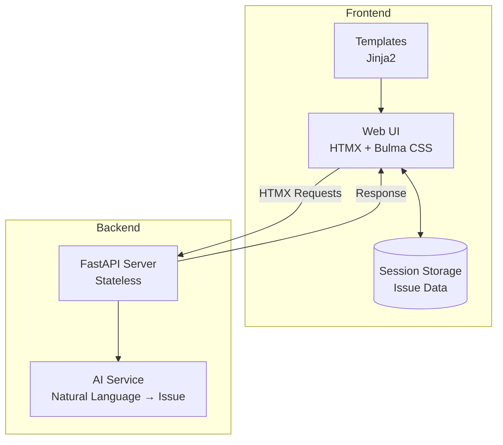
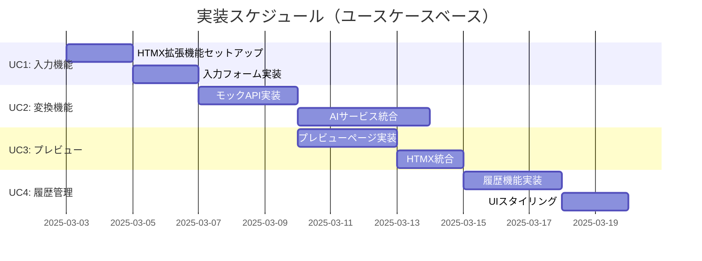

# システムアーキテクチャ設計書

## 1. アーキテクチャ概要



## 2. フロントエンド実装方針

### 2.1 HTMXベースの実装

- すべてのクライアントサイドロジックはHTMXの拡張機能として実装
- JavaScriptはHTMXの機能を拡張する形で統合

```html
<!-- HTMX拡張の例 -->
<div hx-ext="issue-manager">
  <form hx-post="/api/convert"
        hx-target="#preview"
        data-issue-store>
    <textarea name="content"></textarea>
    <button type="submit">Convert</button>
  </form>
</div>
```

### 2.2 HTMX拡張機能の実装

```javascript
htmx.defineExtension('issue-manager', {
    onEvent: function(name, evt) {
        if (name === "htmx:afterRequest") {
            const target = evt.target;
            if (target.hasAttribute("data-issue-store")) {
                // セッションストレージへの保存処理
                const response = JSON.parse(evt.detail.xhr.response);
                this.saveIssue(response);
            }
        }
    },

    saveIssue: function(issue) {
        const issues = JSON.parse(sessionStorage.getItem('issues') || '[]');
        issues.push({
            ...issue,
            id: crypto.randomUUID(),
            created_at: new Date().toISOString()
        });
        sessionStorage.setItem('issues', JSON.stringify(issues));
    }
});
```

## 3. データ管理戦略

### 3.1 セッションストレージ構造

```javascript
{
  "issues": [
    {
      "id": "uuid-v4",
      "title": "Issue Title",
      "story": "User Story",
      "acceptance_criteria": "AC",
      "technical_requirements": "Tech Reqs",
      "created_at": "ISO DateTime",
      "updated_at": "ISO DateTime"
    }
  ],
  "current_issue": null
}
```

### 3.2 データ永続化方針

- セッションストレージを主なデータストアとして使用
- 必要に応じてローカルストレージへのバックアップを実装
- エクスポート機能によるデータバックアップのサポート

## 4. 開発スケジュール



## 5. コンポーネント間の依存関係

- フロントエンド
  - HTMX（基本的なインタラクション）
  - HTMX拡張（カスタムデータ管理）
  - Bulma CSS（スタイリング）
  - Session Storage API（データ永続化）

- バックエンド
  - FastAPI（RESTful API）
  - AI Service（自然言語処理）
  - Jinja2（テンプレートエンジン）

## 6. エラーハンドリング

- セッションストレージの容量制限監視
- データ整合性チェック
- ネットワークエラーのフォールバック処理
- リカバリーメカニズムの実装

## 7. パフォーマンス最適化

- セッションストレージの定期的なクリーンアップ
- 不要なHTTPリクエストの最小化
- レスポンスデータの最適化

## 8. セキュリティ考慮事項

- XSS対策（HTMXのセキュリティベストプラクティス）
- CSRF保護
- 入力データのバリデーション